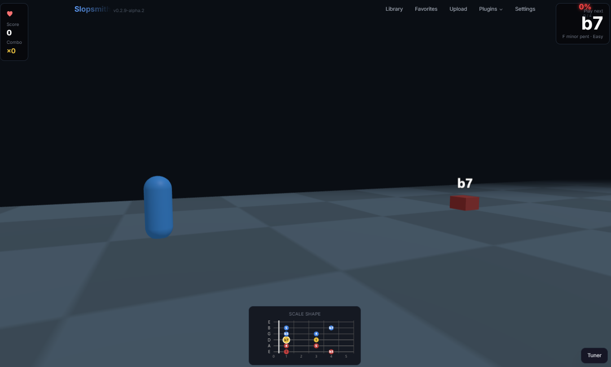

# Scale Runner

A Guitarcade-inspired 3D side-scrolling arcade mini-game plugin for [Slopsmith](https://github.com/byrongamatos/slopsmith). Play the next correct note from your chosen scale to dodge oncoming obstacles. Inspired by Rocksmith 2014's *Scale Runner / Scale Warriors*.



## Features

- 3D side-scroller rendered with Three.js (reuses the Three.js bundled with Slopsmith core — no extra dependencies)
- Real-time pitch detection via the `note_detect` plugin's `createNoteDetector` API
- **Scales**: minor pentatonic and major pentatonic, all 12 keys
- **Difficulty tiers**: Easy / Medium / Hard (cadence + hit window + lives)
- Persistent preferences (scale, key, difficulty) via `localStorage`

## Requirements

- Slopsmith with the `note_detect` plugin installed and enabled
- A guitar input (microphone or DI) — Scale Runner asks for microphone access on first start

## Install

Clone into your Slopsmith plugins directory:

```bash
cd /path/to/slopsmith/plugins
git clone https://github.com/topkoa/slopsmith-plugin-scale-runner.git scale_runner
```

The folder name MUST be `scale_runner` (matching the plugin id). Restart the Slopsmith server, then look for "Scale Runner" in the plugins nav dropdown.

## How to play

1. Click **Scale Runner** in the plugins nav.
2. Pick a scale (minor pent / major pent), key (C–B), and difficulty (Easy / Medium / Hard).
3. Click **Start**. Allow microphone access on first launch.
4. Watch obstacles approach. Each obstacle is labeled with a scale degree (1, b3, 5, ...). Play that note (any octave on standard tuning) before the obstacle reaches your runner.
5. Hit = score + combo. Miss = lose a life. Lose all lives = game over.

## Difficulty tiers

| Tier   | Cadence | Hit window | Lives |
|--------|---------|------------|-------|
| Easy   | 2.5 s   | ±200 ms    | 5     |
| Medium | 2.0 s   | ±150 ms    | 3     |
| Hard   | 1.5 s   | ±100 ms    | 2     |

## License

[AGPL-3.0-only](LICENSE). Matches the Slopsmith ecosystem.

## Contributing

DCO sign-off required (`git commit -s`).
